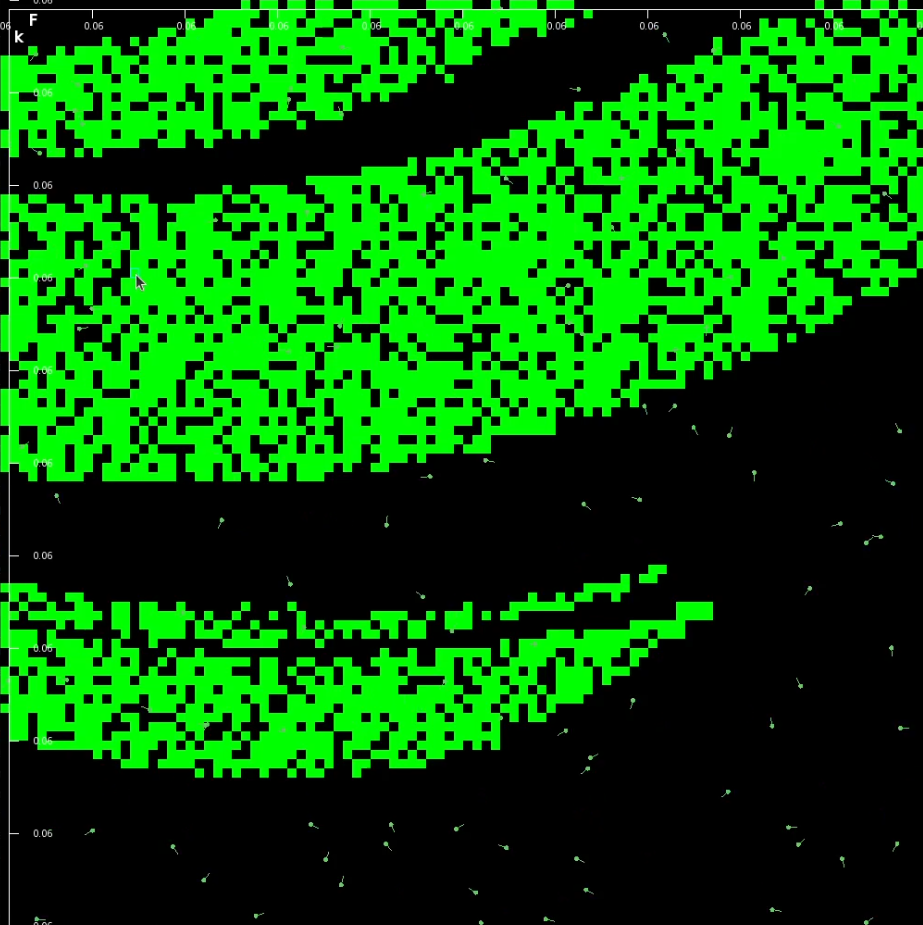

# Turing Pattern Simulation

This is a project which I began under the supervision of John Whitman at SimBioSys.
The aim of the project is to use a particle swarm technique to discover parameter combinations that create Turing patterns in the Gray-Scott reaction-diffusion model.

Gray-Scott model:


[Source](https://www.mrob.com/pub/comp/xmorphia/index.html)

The software allows for two modes of simulation. In particle swarm mode, the user can watch the particle simulation in real time, with green boxes rendering to denote discovered Turing patterns and grey boxes denoting patterns that never stabilized, and thus, while interesting, do not meet the criterea to be called a Turing pattern. This mode leverages the quad tree data structure for efficient particle navigation.


The software also includes a real-time reaction-diffusion simulation mode, in which users can visualize the pattern generated by selected parameters at a larger scale than is available in the preview thumbnail from particle swarm mode.


The intention of the project was to map out the area in parameter space that generates turing patterns. It does this rather well, leading to interesting discoveries such as the following:



When altering the extents of the particle simulation domain (which the user can do themselves) to be (0.060145, 0.061345, 0.061335, 0.061355), Turing patterns are quickly discovered, as they form very densly in this region. I, however, expected that the shape of the domain in which Turing patterns are generated would be convex or relatively simple. Here though, we see three bands (or four, depending on how you count it, and I suppose how good you are at counting), each representing a region where the same or very similar patterns form. There is some gradual variation, for instance in the middle band (visible if you hover over certain regions and watch the preview change), but for the most part, the patterns are nearly identical. I had imagined that the distinct patterns would "bleed" into each other, each one gradually morphing into another. However, it seems from this that there is great discontinuity on the k-axis that separates distinct patterns at this scale.

## Techniques Used

### Concurrency
This program employs a classic producer-consumer model to send data between the particle simulation thread, which handles the UI and visualization, and the pattern detection thread, which must compute massive amounts of data on the GPU for every frame. If the UI were to wait on the GPU to finish, it would slow the program down beyond the point of usability. Instead, a thread safe queue is used to send work to the GPU (producer), and render completed work to the screen (consumer).

### CUDA Pogramming
This project has to compute an enormous number of timesteps to determine if a particle has located a turing pattern. To handle this, it leverages CUDA to compute the timesteps in parallel, using mega-batch processing to further increase parallelism. This allows for rapid computation of the individual reaction-diffusion simulations, each of which must run for 7500 timesteps on a 100x100 grid.

### Quad tree data structure
The particle swarm algorithm is based on [algorithms](https://en.wikipedia.org/wiki/Particle_swarm_optimization) which operate on a continuous surface. In these, a particle would save a local and global best value, which would then influence it's navigation. However, our search condition here is boolean: either a set of parameters generates a turing pattern or it doesn't. To adapt the particle swarm behvaior to this scenario, the code exploits the quad tree data structure to determine which discovered patterns should have their own "pull" on the particles and which should be clustered into a single point of influence (for those farther away from the particle).

## Dependencies

### System-Installed
- **SFML 2.5+** - Graphics library for windowing and rendering
- **CUDA Toolkit** - For GPU acceleration
- **OpenGL** - Required by ImGui-SFML (usually pre-installed on Linux)

### External Libraries (Source Files)
The following libraries should be downloaded as source files into the `external/` directory:

#### ImGui (v1.91.5)
Download these files to `external/imgui/`:
- imgui.h
- imgui.cpp
- imgui_draw.cpp
- imgui_widgets.cpp
- imgui_tables.cpp
- imconfig.h
- imgui_internal.h
- imstb_rectpack.h
- imstb_textedit.h
- imstb_truetype.h

#### ImGui-SFML (v2.6.x)
Download these files to `external/imgui-sfml/`:
- imgui-SFML.h
- imgui-SFML.cpp
- imgui-SFML_export.h

## Building

```bash
mkdir build
cd build
cmake ..
make
```

## Running

```bash
./build/reaction_diffusion
```
